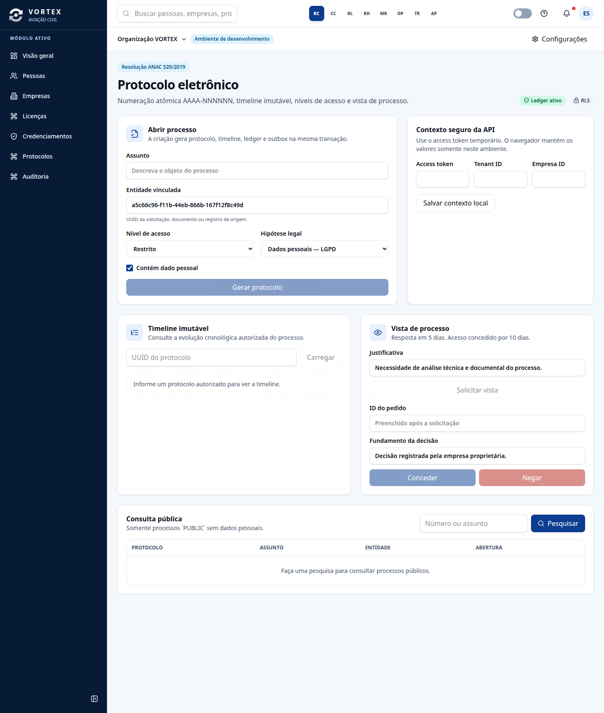

# VORTEX — Fase 2/8

**Ledger imutável, protocolo eletrônico e auditoria**

A Fase 2 amplia a fundação da Fase 1 sem alterar a arquitetura de monólito modular. A entrega implementa o ledger encadeado e assinado, prova Merkle exportável, protocolo eletrônico com numeração atômica, timeline imutável, níveis de acesso, vista de processo, auditoria HTTP ancorada no ledger e verificação diária por cron.



## Resultado executável

O sistema usa **NestJS modular**, **PostgreSQL 16 com RLS**, **Redis**, **RabbitMQ**, **React 19**, **Module Federation** e **Docker Compose**. O projeto Docker foi isolado como `vortex-phase2`, preservando volumes da fase anterior.

| Área | Resultado |
|---|---|
| Ledger | SHA-256 encadeado, Ed25519, posição transacional, diff, verificação e Merkle |
| Concorrência | Ponteiro `ledger.chain_heads` serializa o avanço por tenant |
| Particionamento | Partição padrão e quatro partições mensais antecipadas no aceite |
| Protocolo | Numeração `AAAA-NNNNNN` com incremento atômico no PostgreSQL |
| Acesso | `PUBLIC`, `RESTRICTED`, `PRIVATE`, hipótese de restrição e proteção LGPD |
| Vista | Resposta em 5 dias e acesso por 10 dias, parametrizados e versionados |
| Auditoria | Ações autenticadas, IP, user-agent, entrada redigida, resultado e ledger |
| Cron | Verificação diária às 02:00 UTC com `@nestjs/schedule` |
| Frontend | Criação, timeline, vista, consulta pública, auditoria e exportação Merkle |

## Início rápido

```bash
pnpm install --frozen-lockfile
docker compose up -d --build
```

Para criar um usuário local, gere uma senha efêmera e execute:

```bash
export VORTEX_DEV_PASSWORD="uma-senha-efemera-com-12-ou-mais-caracteres"
docker compose run --rm -e VORTEX_DEV_PASSWORD migrate pnpm db:seed:dev
```

A API fica em `http://localhost:3000`, a documentação OpenAPI em `http://localhost:3000/docs/api` e a Shell em `http://rconta.vortex.localhost:8080/protocolos`.

## Comandos de qualidade

```bash
pnpm check
pnpm test:coverage
pnpm audit --prod --audit-level high
node tools/e2e-phase2.mjs
docker compose run --rm migrate pnpm db:rls-test
```

Os testes SQL complementares estão em `tools/test-phase2-access.sql` e `tools/test-phase2-immutability.sql`.

## Documentação

| Documento | Conteúdo |
|---|---|
| `docs/phase-2-status.md` | Matriz de escopo, evidências e lacunas |
| `docs/architecture-phase-2.md` | Componentes, transações e concorrência |
| `docs/api-phase-2.md` | Rotas, permissões e exemplos |
| `docs/security-and-compliance-phase-2.md` | RLS, imutabilidade e requisitos regulatórios |
| `docs/runbook-phase-2.md` | Operação, verificação, incidentes e recuperação |
| `docs/decisions-phase-2.md` | Decisões e alternativas avaliadas |
| `docs/source-notes-phase-2.md` | Notas extraídas das fontes locais |

## Limites desta fase

A fonte local **IS 43.9-004A** foi consultada. Os PDFs oficiais da Resolução ANAC 458/2017 e da Resolução ANAC 520/2019 não estavam anexados; por isso, a entrega segue os requisitos canônicos fornecidos e registra a validação documental futura como lacuna. Carimbo de tempo externo, ICP-Brasil e documentos estruturados pertencem à Fase 3.
