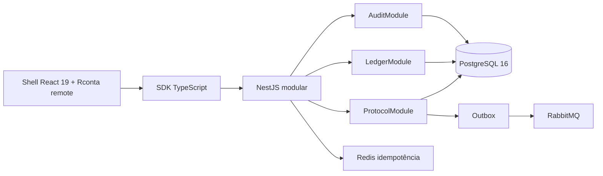
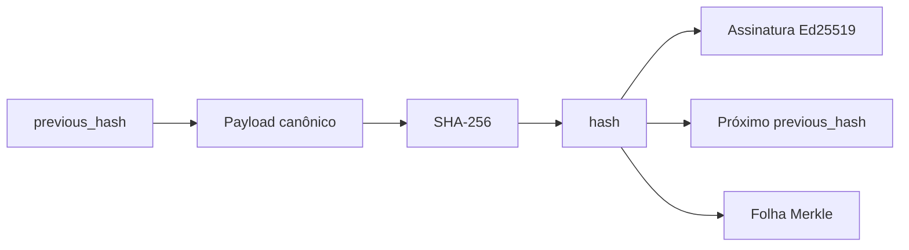

# Arquitetura executável — Fase 2

**Autor:** Manus AI  
**Escopo:** Ledger Imutável, Protocolo Eletrônico e Auditoria

## Visão

A Fase 2 permanece dentro do **monólito modular NestJS**. Os módulos `ledger`, `protocol` e `audit` compartilham a mesma transação PostgreSQL quando uma ação exige consistência forte. Essa escolha evita chamadas de rede, coordenação distribuída e compensações entre serviços em uma VPS dedicada.

## Ledger

Cada escrita obtém um bloqueio transacional por tenant e bloqueia a linha correspondente em `ledger.chain_heads`. O serviço calcula o próximo hash a partir de `last_hash`, atribui `chain_position`, assina o hash com Ed25519 e atualiza o ponteiro na mesma transação.

A verificação não depende de ordenação física. Ela reconstrói o caminho a partir do hash zero, exige exatamente um sucessor por hash, recalcula cada hash e valida cada assinatura. Bifurcação, bloco desconectado, payload alterado ou assinatura inválida produzem `TAMPERED` e `first_broken_block`.

## Protocolo eletrônico

`protocol.next_protocol_number()` mantém uma linha por ano em `protocol.sequences`. O comando `INSERT ... ON CONFLICT ON CONSTRAINT sequences_pkey DO UPDATE` incrementa a sequência de modo atômico. O limite anual é 999.999 protocolos.

A criação de um protocolo executa, em uma transação: geração do número, inserção do processo, bloco do ledger do processo, primeiro evento da timeline, bloco do ledger do evento e outbox. Cada evento posterior recebe bloco próprio.

## Acesso e vista

O modelo aplica `PUBLIC`, `RESTRICTED` e `PRIVATE`. Dados pessoais não podem ser públicos. Protocolos restritos exigem hipótese de restrição e são visíveis apenas no contexto da empresa atual, para o criador ou mediante vista concedida. Pedidos de vista preservam a empresa solicitante e a empresa proprietária. Apenas a empresa proprietária pode decidir.

Os prazos são registros versionados em `compliance.regulatory_parameters`:

| Chave | Valor | Uso |
|---|---:|---|
| `protocol.view.response_days` | 5 | Prazo para decidir a vista |
| `protocol.view.access_days` | 10 | Vigência do acesso concedido |
| `ledger.partition.months_ahead` | 3 | Horizonte mínimo de partições futuras |
| `ledger.verification.interval_hours` | 24 | Referência canônica da periodicidade diária |

## Auditoria

O interceptor registra respostas bem-sucedidas. O filtro global registra falhas autenticadas, incluindo negações de permissão e validações. O registro contém usuário, tenant, empresa, request ID, IP, user-agent, ação, entidade, valores redigidos, resultado, código HTTP e hash da resposta. Senhas, tokens, cookies, segredos e assinaturas são substituídos por `[REDACTED]`.

A tabela `ledger.audit_events` é append-only. Triggers rejeitam `UPDATE` e `DELETE`. Cada evento aponta para um bloco específico do ledger.

## Cron e partições

`LedgerIntegrityMonitor` usa `@Cron('0 2 * * *', { timeZone: 'UTC', waitForCompletion: true })`. A rotina cria partições mensais antecipadas, percorre os tenants ativos, verifica a cadeia e persiste o resultado em `ledger.verification_runs`, também ancorado no ledger.

Em uma única instância na VPS, o cron embutido reduz custo operacional. Em futura escala horizontal, a evolução recomendada é uma trava distribuída PostgreSQL ou um worker único dedicado; migrar para microserviços não é necessário.
