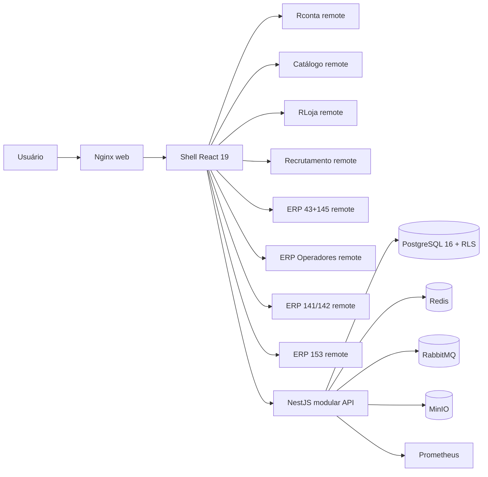
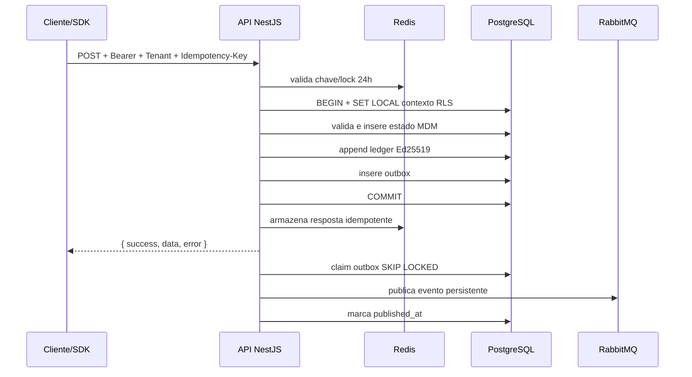
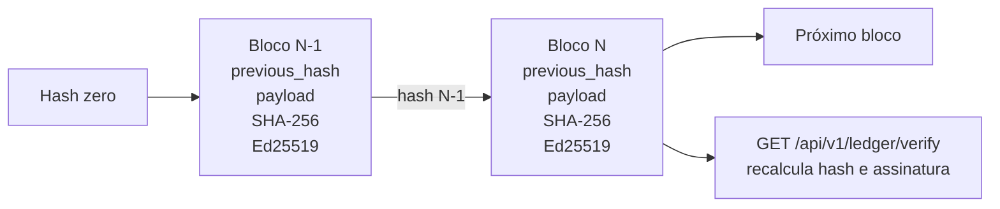

# Arquitetura executável da Parte 1

**Autor:** Manus AI  
**Estado:** implementada e validada em ambiente Docker

## Síntese

A Parte 1 usa um **monólito modular NestJS** para as capacidades backend e **micro-frontends federados** para os oito aplicativos. Essa separação preserva limites de domínio no código sem introduzir custo operacional, latência de rede e problemas de consistência distribuída prematuramente. A decisão também segue a diretriz do projeto de operar inicialmente em servidor virtual privado dedicado.

O banco PostgreSQL 16 mantém dez schemas de domínio. Dados de identidade são globais. O tenant atua como contexto de autorização. A aplicação define `app.current_user_id`, `app.current_tenant_id` e `app.current_company_id` em cada transação. As políticas RLS combinam associação ao tenant e vínculo ativo com a empresa.

## Monólito modular

A amostra de estrutura da especificação enumera serviços por capacidade. A instrução de projeto de maior precedência exige **monólito modular, não microserviços**. Por isso, autenticação, identidade, ledger, outbox, regulação, health e métricas residem em `apps/api`, mas permanecem organizados como módulos independentes.

| Critério | Monólito modular adotado | Microserviços descartados nesta fase |
|---|---|---|
| Consistência | Uma transação atômica cobre estado, ledger e outbox | Exigiria coordenação distribuída ou sagas |
| Latência | Chamadas internas no mesmo processo | Saltos de rede entre capacidades centrais |
| Operação em VPS | Uma API para implantar, observar e dimensionar | Vários deploys, redes, certificados e pools |
| Custo | Compartilha processo e conexões | Multiplica consumo mínimo de memória e CPU |
| Evolução | Limites de módulos permitem extração futura | Anteciparia complexidade sem carga comprovada |

O `CqrsModule` está preparado no núcleo. O fluxo da Parte 1 ainda usa serviços de aplicação diretos. A adoção integral de command handlers, read models e event sourcing ocorrerá quando os agregados operacionais das Partes 2–7 justificarem essa separação.

## Fluxo de escrita

Toda escrita autenticada passa por validação de DTO, JWT, escopo, papel, contexto de tenant e empresa, rate limit e idempotência. A operação de domínio é inserida primeiro com referência diferida ao ledger. Em seguida, a mesma transação registra o bloco assinado e o evento na outbox. Se qualquer etapa falhar, a transação inteira é revertida.

## Frontend federado

A Shell é o host de Module Federation. O subdomínio seleciona o aplicativo ativo, o menu lateral e o remote carregado. A top bar mantém os oito lançadores. Cada remote expõe `./App`, importa o Design System e possui bundle próprio. Um error boundary captura falhas de remote sem derrubar a Shell.

O contrato `@vortex/contracts-fe` contém identificador, subdomínio, remote entry, cor e navegação. O Design System `@vortex/ui-core` contém tokens CSS e TypeScript, temas claro e escuro, white-label por variáveis, logomarca vetorial e os componentes base solicitados.

## Dados e RLS

| Schema | Estado na Parte 1 |
|---|---|
| `identity` | Implementado: tenants, usuários, empresas, vínculos, procurações, perfis, licenças e credenciamentos |
| `ledger` | Implementado: blocos particionados e outbox |
| `oauth` | Implementado: credenciais e refresh tokens rotativos |
| `compliance` | Implementado: parâmetros regulatórios versionados da Parte 1 |
| `protocol`, `documents`, `catalog`, `subscriptions`, `signatures`, `notifications` | Schema criado; funcionalidades pertencem às partes posteriores |

As tabelas sensíveis de `identity` e `ledger`, inclusive a partição padrão, têm RLS habilitado e forçado. Funções `SECURITY DEFINER` expõem somente operações internas delimitadas. O papel da aplicação não possui acesso direto às tabelas de credenciais.

## Ledger

O ledger usa hash SHA-256 encadeado por tenant, assinatura Ed25519 e partição temporal. Um advisory lock de 64 bits serializa o append por tenant. Triggers rejeitam `UPDATE` e `DELETE`. Constraint triggers diferidos validam, no commit, que cada referência MDM aponta para um bloco realmente existente.

A prova de Merkle exportável ainda não integra a Parte 1. O hash encadeado e a assinatura individual formam a base criptográfica para essa evolução.

## Referências

[1]: canonical/prompts/parte-1.md "VORTEX — Parte 1/8: Fundação, Shell Unificada, Design System e Núcleo de Identidade"
[2]: canonical/07-delimitacao.md "Delimitação e precedência das fontes canônicas"
[3]: canonical/04-enums-controlados.md "Enums controlados do VORTEX"
[4]: canonical/05-seeds-rbac.md "Seeds regulatórios e de RBAC"
